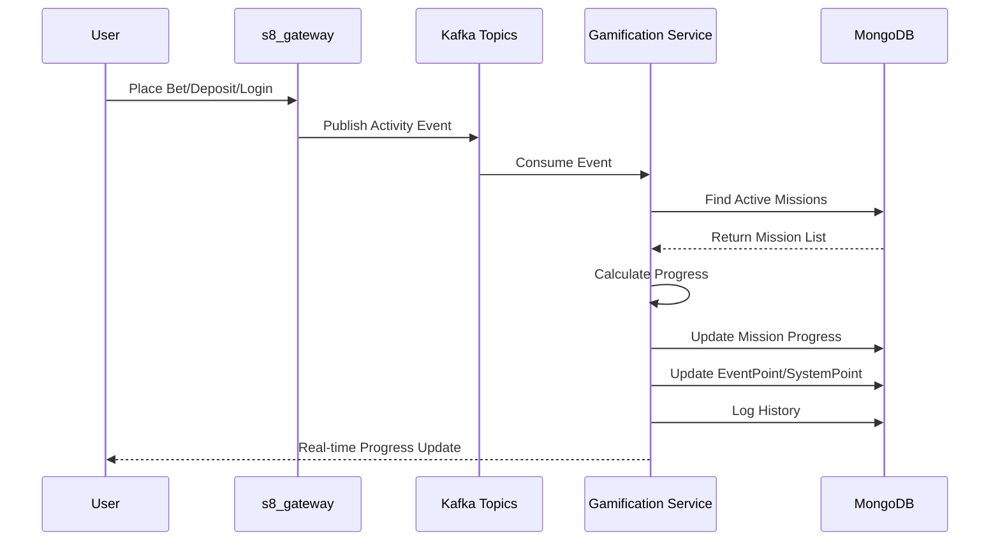
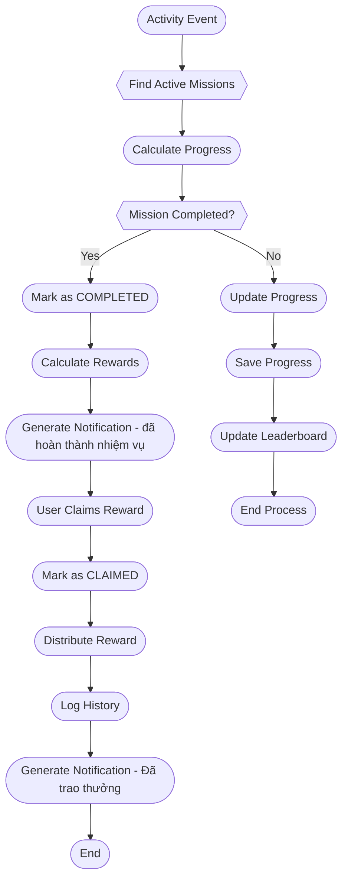
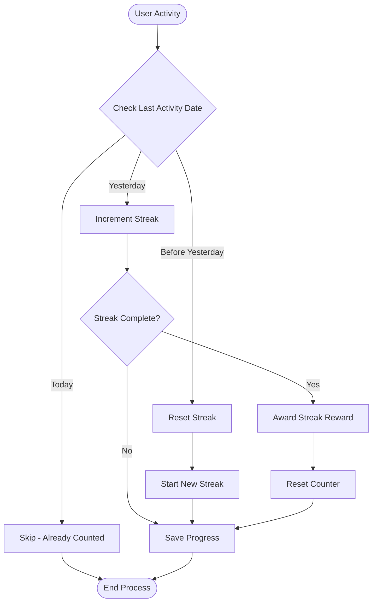
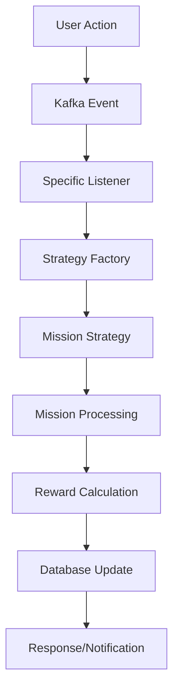

# THIẾT KẾ HỆ THỐNG GAMIFICATION S8 EVENT

## TỔNG QUAN KIẾN TRÚC

### MỤC TIÊU HỆ THỐNG
- **Tăng engagement**: Khuyến khích user tham gia các hoạt động trên platform
- **Personalization**: Cung cấp trải nghiệm cá nhân hóa cho từng user  
- **Scalability**: Hỗ trợ mở rộng cho hàng triệu user đồng thời
- **Real-time**: Xử lý và cập nhật điểm số theo thời gian thực
- **Flexibility**: Dễ dàng tạo và quản lý các event/mission mới

### ỨNG DỤNG THỰC TẾ TRONG BETTING PLATFORM

#### **Tournament & Event Đua Top**
Hệ thống được thiết kế để hỗ trợ các loại event phổ biến trong ngành betting:

**1. Tournament Casino:**
- **Slot Tournament**: Đua top winnings trong 7 ngày
- **Blackjack Challenge**: Ai thắng nhiều ván nhất
- **Baccarat VIP**: Cược cao nhất trong tháng

**2. Sports Betting Events:**
- **Euro Cup Prediction**: Dự đoán chính xác nhất
- **NBA Finals**: Tổng cược cao nhất 
- **Wimbledon Week**: Cược live tennis nhiều nhất

**3. Daily/Weekly Challenges:**
- **Daily Login Streak**: 30 ngày liên tiếp
- **Deposit Milestone**: Nạp đủ 1M trong tuần
- **Multi-Game Master**: Chơi ít nhất 5 game khác nhau

---

## CÁC THÀNH PHẦN CHÍNH

### 1. CONFIGURATION LAYER - Quản Lý Cấu Hình

#### MissionConfig - Cấu Hình Nhiệm Vụ  
```java
@Document(collection = "mission_config")
public class MissionConfig extends BaseModel {
    private String code;                    // Mã mission
    private BigDecimal target;              // Mục tiêu cần đạt
    private Integer duration;               // Thời gian hoàn thành (-1 = vô thời hạn)
    private UnitType unit;                  // Đơn vị thời gian (HOUR, DAY, WEEK, MONTH, YEAR)
    private MissionType type;               // Loại mission (30+ types)
    private MissionCategory category;       // Phân loại: BETTING, FINANCIAL, SOCIAL, etc.
    private Condition condition;            // Điều kiện hợp lệ
    private MissionMode mode;               // Chế độ hoạt động
    private MissionReward reward;           // Phần thưởng
    private Streak streak;                  // Cấu hình streak
    private ConfigType configType;          // Loại config
}
```

**Mission Types (30+ Loại):**

**BETTING Category:**
- `BET_COUNT`: Đặt cược N lần
- `BET_AMOUNT`: Đặt cược M VND
- `WIN_STREAK`: Thắng N lần liên tiếp
- `BET_FIRST_TIME`: Đặt cược lần đầu tiên
- `WIN_AMOUNT`: Thắng đạt M VND
- `LIVE_BET`: Đặt cược trận trực tiếp
- `MULTI_BET`: Đặt cược nhiều trận cùng lúc
- `ACCUMULATOR_BET`: Đặt cược tích lũy

**FINANCIAL Category:**
- `DEPOSIT_FIRST_TIME`: Nạp tiền lần đầu tiên
- `DEPOSIT_AMOUNT`: Nạp tiền đạt M VND
- `DEPOSIT_STREAK`: Nạp tiền N ngày liên tiếp
- `DEPOSIT_TOTAL`: Tổng nạp tiền đạt M VND
- `UPDATE_PAYMENT`: Cập nhật phương thức thanh toán

**SOCIAL Category:**
- `REFER_FRIEND`: Giới thiệu N người bạn
- `SHARE_RESULT`: Chia sẻ kết quả cược
- `JOIN_TOURNAMENT`: Tham gia giải đấu
- `INVITE_TOURNAMENT`: Mời bạn tham gia giải đấu

**DAILY Category:**
- `DAILY_LOGIN`: Đăng nhập N ngày
- `CHECK_IN`: Điểm danh

**PROFILE Category:**
- `COMPLETE_PROFILE`: Hoàn thành hồ sơ
- `KYC`: Xác thực danh tính

**RESPONSIBLE_GAMING Category:**
- `LOSE_STREAK`: Thua N lần liên tiếp
- `SET_BET_LIMIT`: Thiết lập giới hạn cược
- `TAKE_BREAK`: Nghỉ ngơi N ngày

**SPECIAL Category:**
- `VIP_UPGRADE`: Nâng cấp hạng VIP
- `SEASONAL_EVENT`: Tham gia sự kiện mùa
- `LOYALTY_MILESTONE`: Đạt mốc trung thành
- `BONUS_CLAIM`: Nhận bonus đặc biệt

### 2. MISSION LAYER - Xử Lý Nhiệm Vụ

#### MissionRecord - Theo Dõi Tiến Độ User
```java
@Document(collection = "mission_record")
public class MissionRecord extends BaseModel {
    private String userId;                          // User thực hiện
    private MissionType type;                       // Loại mission (optional, có thể bỏ)
    private List<ClaimedMission> claimedMission;    // Lịch sử claim rewards
    private MissionMeta meta;                       // Metadata (bet status, game info)
    private List<MissionProgress> missionProgress;  // Progress tracking cho từng mission
}
```

**MissionProgress - Tracking Individual Mission:**
```java
public static class MissionProgress {
    private String missionCode;             // Mã mission config
    private String eventCode;               // Event context (optional)
    private String packageCode;             // Package context (optional)
    private String giftCode;                // Gift context (optional)
    private MissionType type;               // Loại mission
    private BigDecimal target;              // Target cần đạt
    private BigDecimal currentProgress;     // Progress hiện tại
    private LocalDateTime startDate;        // Ngày bắt đầu mission
    private LocalDateTime endDate;          // Ngày kết thúc mission (nếu có duration)
    private Integer duration;               // Duration của mission
    private UnitType unit;                  // Unit của duration
    private MissionStatus status;           // Trạng thái mission
    private LocalDateTime lastUpdated;      // Lần cập nhật cuối
    
    // Business methods
    public BigDecimal getProgressPercentage();      // Tính phần trăm hoàn thành
    public BigDecimal getRemainingTarget();         // Lấy phần còn lại cần hoàn thành
    public boolean isCompleted();                   // Kiểm tra đã hoàn thành chưa
    public boolean isExpired();                     // Kiểm tra có hết hạn không
    public boolean isActive();                      // Kiểm tra mission có đang active không
    public void updateProgress(BigDecimal additionalProgress); // Cập nhật progress
    public void resetProgress();                    // Reset progress về 0
}
```

### 5. DATA FLOW & INTEGRATION PATTERNS

#### End-to-End Mission Flow


#### Mission Completion & Reward Flow


#### Streak Processing Logic


### 6. API ENDPOINTS & INTERFACES

#### Core Mission APIs
```java
@RestController
@RequestMapping("/api/v1/missions")
public class MissionController {
    
    @GetMapping("/user/{userId}/active")
    public ResponseEntity<List<MissionProgress>> getActiveMissions(@PathVariable String userId);
    
    @GetMapping("/user/{userId}/completed") 
    public ResponseEntity<List<MissionProgress>> getCompletedMissions(@PathVariable String userId);
    
    @GetMapping("/leaderboard/{eventCode}")
    public ResponseEntity<List<LeaderboardEntry>> getLeaderboard(@PathVariable String eventCode);
    
    @GetMapping("/user/{userId}/points")
    public ResponseEntity<UserPointSummary> getUserPoints(@PathVariable String userId);
    
    @GetMapping("/events/{eventCode}/pot")
    public ResponseEntity<EventPotInfo> getEventPot(@PathVariable String eventCode);
}
```

#### Real-time Updates via WebSocket
```java
@MessageMapping("/mission/progress")
@SendToUser("/queue/mission-updates")
public class MissionWebSocketController {
    
    public void broadcastMissionProgress(String userId, MissionProgress progress);
    
    public void broadcastStreakUpdate(String userId, MissionStreak streak);
    
    public void broadcastRewardClaimed(String userId, MissionReward reward);
    
    public void broadcastLeaderboardUpdate(String eventCode, List<LeaderboardEntry> entries);
}
```

#### MongoDB Indexes
```javascript
// Mission Record Indexes
db.mission_record.createIndex({"userId": 1, "status": 1});
db.mission_record.createIndex({"userId": 1, "missionProgress.missionCode": 1});
db.mission_record.createIndex({"status": 1, "createdTime": -1});

// Mission Streak Indexes  
db.mission_streak.createIndex({"userId": 1, "missionConfigCode": 1}, {unique: true});
db.mission_streak.createIndex({"userId": 1, "eventCode": 1, "missionType": 1});
db.mission_streak.createIndex({"missionType": 1, "requiredStreak": 1});

// Event Point Indexes
db.event_point.createIndex({"eventCode": 1, "userId": 1}, {unique: true});
db.event_point.createIndex({"eventCode": 1, "point": -1});

// Leaderboard Indexes
db.leaderboard.createIndex({"eventCode": 1, "rank": 1});
db.leaderboard.createIndex({"userId": 1, "eventCode": 1});

// History Indexes
db.history.createIndex({"userId": 1, "createdTime": -1});
db.history.createIndex({"changeType": 1, "createdTime": -1});
```
---

## 🎯 IMPLEMENTATION CHECKLIST

### Phase 1: Core Foundation 
- [x] MissionConfig with 30+ mission types
- [x] MissionRecord with embedded MissionProgress
- [x] MissionStreak for cross-day tracking
- [x] Basic ActivityTrackingService with Kafka integration

### Phase 2: Advanced Features 
- [ ] Real-time leaderboard updates
- [ ] EventPot dynamic contribution
- [ ] WebSocket notifications
- [ ] Advanced streak algorithms

### Phase 3: Production Ready 
- [ ] Comprehensive testing suite
- [ ] Performance optimization
- [ ] Security hardening
- [ ] Monitoring & alerting
- [ ] Documentation finalization

### Phase 4: Scaling & Enhancement 
- [ ] Multi-region deployment
- [ ] Advanced analytics
- [ ] Machine learning integration
- [ ] Mobile app support

---

**Strategy Mapping:**
| Event Type | Strategy Bean | Mission Types |
|------------|---------------|---------------|
| **LoginDTO** | loginMissionStrategy | LOGIN, DAILY_LOGIN |
| **DepositApprovedDTO** | depositMissionStrategy | DEPOSIT, DEPOSIT_AMOUNT |
| **ValidBetDTO** | validBetMissionStrategy | VALID_BET, BET_AMOUNT, WIN_AMOUNT |

### Event Processing Flow


---

## Kết lại là

### Ưu Điểm Thiết Kế
2. **Event-Driven**: Phản ứng real-time với user actions
3. **Flexible Configuration**: Dễ dàng tạo events/missions mới
4. **Scalable Architecture**: Hỗ trợ scale horizontal
5. **Comprehensive Tracking**: Audit trail đầy đủ
6. **Multi-Context Support**: Hỗ trợ Event, Package, Gift contexts
7. **Advanced Streak System**: Theo dõi streak phức tạp qua nhiều ngày

### Roadmap Tương Lai
- **AI-Powered Personalization**: Gợi ý missions phù hợp
- **Mobile Push**: Thông báo real-time cho mobile app
- **Dynamic UI**: UI tự động thay đổi theo user behavior
- **Advanced Analytics**: Phân tích sâu user engagement
- **Cross-Game Tournaments**: Tournament xuyên suốt nhiều games

---

*Thiết kế này đảm bảo hệ thống gamification không chỉ đáp ứng nhu cầu hiện tại mà còn sẵn sàng cho sự phát triển trong tương lai với khả năng xử lý real-time và multi-context support.* 
